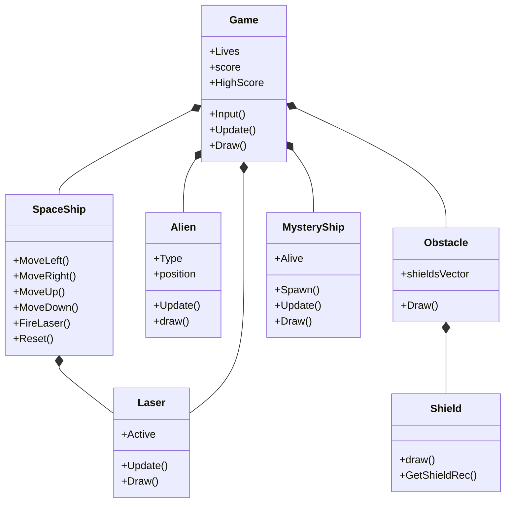

<div align="center">

# Space Invaders
### A desktop arcade game recreation focused on object oriented design, real time gameplay systems, collision handling, and resource management

[](https://isocpp.org/)
[](https://www.raylib.com/)
[](#publish-and-download)
[](#software-design)
[](https://github.com/MahmoudNagiubX/Space-Invaders-Game/actions/workflows/release.yml)
[](#project-status)

**Control a spaceship, defend destructible shields, clear a 75 alien formation, hunt the mystery ship, and protect a persistent high score across game sessions.**

[Publish Windows Demo](https://github.com/MahmoudNagiubX/Space-Invaders-Game/actions/workflows/release.yml)
·
[Browse Source](./Space%20Invaders/src)

</div>

---


---

## Project Overview

This repository contains a playable **Space Invaders-inspired desktop game** implemented with **C++14** and **raylib 5.0**.

The project was built as a hands-on exercise in the systems behind a real-time game: input processing, update/render separation, entity behavior, projectile lifecycles, collision detection, audio, game-state transitions, score persistence, and texture ownership.

Rather than placing all behavior in one file, the implementation separates the main responsibilities into classes for the game controller, spaceship, aliens, lasers, shields, obstacles, and mystery ship.

---

## Gameplay

The player starts with three lives and faces a formation of **75 aliens arranged in five rows and fifteen columns**. Each alien type awards a different score, enemy projectiles damage the player and the shields, and a mystery ship periodically crosses the top of the screen for a bonus opportunity.

The match ends when:

- Every alien is destroyed — **you win**.
- The player loses all lives — **game over**.
- An alien collides with the spaceship — **game over**.

After a win or loss, press `Enter` to reset the entities and start a new match.

### Controls

| Input | Action |
|---|---|
| `Left Arrow` | Move left |
| `Right Arrow` | Move right |
| `Up Arrow` | Move up |
| `Down Arrow` | Move down |
| `Space` | Fire laser |
| `Enter` | Restart after winning or losing |
| `Esc` | Close the game window |

## Core Systems

| System | Implementation |
|---|---|
| **Game loop** | Raylib update-and-render loop running at a target of 144 FPS |
| **Game states** | Welcome sequence, active match, win state, game-over state, and restart flow |
| **Player controller** | Four-direction movement, screen boundaries, firing cooldown, lives, and reset behavior |
| **Alien formation** | Three alien types, shared textures, horizontal formation movement, and randomized enemy fire |
| **Projectiles** | Separate player and enemy laser collections with active/inactive lifecycle cleanup |
| **Collision handling** | Lasers against aliens, mystery ship, shields, and player; aliens against player |
| **Destructible defense** | Four obstacles generated from a `13 × 23` binary grid of individual shield cells |
| **Scoring** | Alien-type scores, 500-point mystery ship bonus, and persistent high-score tracking |
| **Audio and visuals** | Background music, laser/explosion sounds, sprites, custom font, and space background |
| **Resource lifecycle** | Constructors load game resources and destructors release textures, music, and sounds |

## Scoring

| Target | Points |
|---|---:|
| Lower-row alien | 100 |
| Middle-row alien | 200 |
| Top-row alien | 300 |
| Mystery ship | 500 |

The highest score is saved to `highscore.txt` and loaded again when the game starts.

## Software Design



### Responsibility Breakdown

| Module | Responsibility |
|---|---|
| `main.cpp` | Window/audio initialization, welcome timer, main loop, HUD, and top-level rendering |
| `Game` | Match state, entity collections, collisions, score, lives, win/loss logic, and high-score persistence |
| `SpaceShip` | Player texture, movement boundaries, shooting cooldown, laser collection, and reset |
| `Alien` | Alien type, shared texture loading, rendering, movement, and collision bounds |
| `Laser` | Projectile movement, bounds checking, active state, drawing, and collision rectangle |
| `Obstacle` | Converts a binary grid into destructible shield-cell objects |
| `Shield` | Represents one destructible `3 × 3` defense cell |
| `MysteryShip` | Random-side spawning, timed appearance, movement, bonus collision, and texture lifecycle |

## Repository Structure

```text
Space-Invaders-Game/
├── .github/workflows/release.yml
├── README.md
└── Space Invaders/
    ├── src/
    │   ├── main.cpp
    │   ├── Game.cpp / Game.hpp
    │   ├── SpaceShip.cpp / SpaceShip.hpp
    │   ├── Alien.cpp / Alien.hpp
    │   ├── Laser.cpp / Laser.hpp
    │   ├── Obastacle.cpp / Obastacle.hpp
    │   ├── Shield.cpp / Shield.hpp
    │   ├── MysteryShip.cpp / MysteryShip.hpp
    │   └── ball.cpp / ball.h          # Starter-template sample; not part of the game flow
    ├── Font/
    ├── Graphics/
    ├── Sounds/
    ├── highscore.txt
    ├── Makefile
    ├── main.code-workspace
    └── README.md
```

> The filename `Obastacle` is preserved because it is the name currently used by the source includes. It represents the game's obstacle/shield system.

## Publish and Download

The repository includes a GitHub Actions workflow that packages the existing Windows build with its graphics, sounds, font, runtime DLLs, clean high-score file, and play instructions.

To publish the first release:

1. Open **Actions** in the repository.
2. Select **Publish Windows Demo**.
3. Choose **Run workflow**.
4. Keep the version as `v1.0.0` and start the run.

After the workflow succeeds, the playable package will be available as:

[`Space-Invaders-Windows-v1.0.0.zip`](https://github.com/MahmoudNagiubX/Space-Invaders-Game/releases/download/v1.0.0/Space-Invaders-Windows-v1.0.0.zip)

To play:

1. Extract the complete ZIP archive.
2. Open the extracted folder.
3. Run `SpaceInvaders.exe`.

> [!IMPORTANT]
> Keep `SpaceInvaders.exe`, the available runtime DLL files, `Graphics/`, `Sounds/`, `Font/`, and `highscore.txt` together. The game loads resources using relative paths.

The downloadable package is intended as an educational Windows demo. See [Credits and Asset Notes](#credits-and-asset-notes) before redistributing it.

## Build and Run

### Requirements

- Windows 10 or later for the documented desktop workflow.
- A C++14-compatible compiler.
- raylib 5.0 or a compatible installation.
- Git.

### Clone

```bash
git clone https://github.com/MahmoudNagiubX/Space-Invaders-Game.git
cd Space-Invaders-Game/"Space Invaders"
```

### Build with g++ on Windows

Run the following command from the `Space Invaders` directory in a raylib-configured MinGW/w64devkit terminal:

```bash
g++ -std=c++14 \
  src/main.cpp \
  src/Game.cpp \
  src/SpaceShip.cpp \
  src/Alien.cpp \
  src/Laser.cpp \
  src/Obastacle.cpp \
  src/Shield.cpp \
  src/MysteryShip.cpp \
  -o SpaceInvaders.exe \
  -lraylib -lopengl32 -lgdi32 -lwinmm
```

Then run:

```bash
./SpaceInvaders.exe
```

> [!IMPORTANT]
> Run the executable from the `Space Invaders` directory. The game loads `Graphics/`, `Sounds/`, `Font/`, and `highscore.txt` through relative paths.

### VS Code Workflow

The repository includes `main.code-workspace` and was developed from a raylib C++ VS Code starter workflow. Open the workspace only after confirming its folder entries and compiler paths match your local environment.

### Makefile Note

The included Makefile is inherited from the raylib starter template and still contains the original C-oriented source defaults. The explicit C++ command above reflects the game's current source files more accurately.

## Project Status

The current repository is a **playable learning and portfolio project** with Windows release automation configured through GitHub Actions. The source demonstrates a complete gameplay loop, although the project does not currently include automated gameplay tests or CI-based source compilation.

### Engineering Improvements I Would Make Next

- Convert movement to delta-time-based updates for frame-rate-independent behavior.
- Introduce configurable difficulty, alien descent, and multiple levels or waves.
- Replace hard-coded dimensions and timing values with centralized configuration.
- Add CMake for reproducible cross-platform builds.
- Add deterministic tests for scoring, collisions, restart behavior, and high-score persistence.
- Remove unused starter files and machine-specific workspace references.
- Build release binaries from source in CI instead of packaging a committed executable.
- Replace or properly license all third-party audio, font, and visual assets before redistribution.

## What This Project Demonstrates

- Object-oriented C++ design.
- Real-time update/render loops.
- Entity and projectile lifecycle management.
- Collision detection across multiple entity types.
- Persistent local state using file I/O.
- Resource loading and cleanup with raylib.
- Debugging interactions between gameplay systems.
- Turning a starter workflow into a complete interactive application.
- Automating a portable Windows package and GitHub Release workflow.

## Developer

### Mahmoud Nagiub

I am a Software Engineering student building practical projects across software engineering, AI, and systems development. This project strengthened my foundation in **C++**, object-oriented design, real-time application flow, collision systems, state management, resource ownership, and debugging behavior that emerges when multiple systems run every frame.

- GitHub: [@MahmoudNagiubX](https://github.com/MahmoudNagiubX)
- LinkedIn: [Mahmoud Nagiub](https://www.linkedin.com/in/mahmoudnagiubb/)

## Credits and Asset Notes

The repository was developed using a **raylib C++ Visual Studio Code starter-template workflow** whose original project documentation credits **educ8s**. raylib is maintained by its respective contributors.

Space Invaders is an established arcade-game concept. This repository is an educational recreation and is not affiliated with the original rights holders.

The repository includes third-party-style music, font, graphics, and sound files. Their redistribution rights are not documented in this repository and should be verified before publishing or redistributing the demo commercially.

## License Status

No project-level open-source license is currently included. Source availability on GitHub does not by itself grant permission to reuse, modify, or redistribute the project or its bundled assets.

---

<div align="center">

**Built to understand the systems behind an arcade game—not only to reproduce the screen.** 👾

</div>
